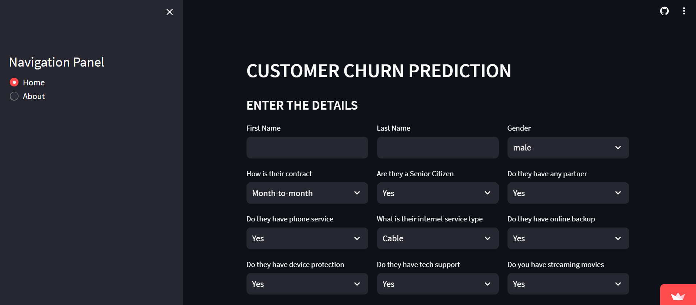

[# Customer Churn Prediction](https://aditya-customer-churn-prediction.streamlit.app/)

## Project Overview

Welcome to the Customer Churn Prediction project! This repository contains all the code and resources needed to predict customer churn using machine learning techniques. Churn prediction is a critical task for businesses to identify customers who are likely to stop using their services, allowing them to take proactive measures to retain those customers.

## Data
The data contains 7000 data points each represnting information about the customer. The data set includes information about:
* Customers who left within the last month – the column is called Churn
* Services that each customer has signed up for – phone, multiple lines, internet, online security, online backup, device protection, tech support, and streaming TV and movies
* Customer account information – how long they’ve been a customer, contract, payment method, paperless billing, monthly charges, and total charges
* Demographic info about customers – gender, age range, and if they have partners and dependents

## Preprocessing
The data is been preprocessed and has been encoded with help of sklearn library to make it suitable to work in Artificial Neural Network (ANN) 

## Models
1. Model 1 Description
   * The model contains 2 hidden layers and one output layer
     1. Layer 1 contains 10 nodes and activation function as ReLU
     2. Layer 2 contains 5 nodes and activation function as ReLU
     3. Output Layer contains 1 node and activation function as Sigmoid
    
   * Model uses Adam optimizer with learing rate of 0.001
   * Model uses Binary_CrossEntropy loss to calculate the loss at every step and metrics is accuracy
   * Model is ran over 100 epochs
   * Model has accuracy of 77.29 % 

   
2. Model 2 Description
   * The model contains 3 hidden layers and one output layer
     1. Layer 1 contains 15 nodes and activation function as ReLU
     2. Layer 2 contains 10 nodes and activation function as ReLU
     3. Layer 3 contains 5 nodes and activation function as ReLU
     4. Output Layer contains 1 node and activation function as Sigmoid 
    
   * Model uses Adam optimizer with learing rate of 0.001
   * Model uses Binary_CrossEntropy loss to calculate the loss at every step and metrics is accuracy
   * Model is ran over 100 epochs
   * Model has accuracy of 76.63 %
  
 3. Model 3 Description

      * The model contains 6 hidden layers and one output layer
      
      
          1. Layer 1 contains 40 nodes and activation function as linear
          1. Layer 2 contains 30 nodes and activation function as linear
          1. Layer 3 contains 20 nodes and activation function as ReLU
          1. Layer 4 contains 15 nodes and activation function as ReLU
          1. Layer 5 contains 10 nodes and activation function as ReLU
          1. Layer 6 contains 5 nodes and activation function as ReLU
          1. Output Layer contains 1 node and activation function as Sigmoid 
          
          
      * Model uses Adam optimizer with learing rate of 0.001
      * Model uses Binary_CrossEntropy loss to calculate the loss at every step and metrics is accuracy
      * Model is ran over 1000 epochs
      * The model has accuracy of 80.03 %
   
## Contents of repositary

-`mymodel3`: This is the folder which stores the variables of model 3 which has the highest accuracy  
-`notebooks`: This folder contains `customer churn analysis.ipynb` which has all workings of the project  
-`cc-streamlit.py`: This python file contains the front-end part of the project created using Streamlit  
-`requirements.txt`: It contains all the necessary libraries and packages used int te project  
